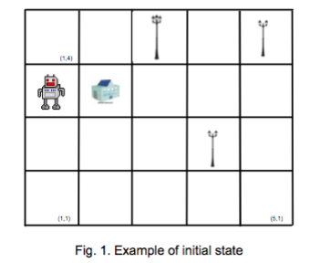

# Robot-Rule-Based-System

We have a robot, several lampposts with blown bulbs and a bulb warehouse, lying on a grid as shown in Figure 1. Each lamppost may have several blown bulbs. The objective is that the robot loads bulbs at the warehouse to replace blown bulbs. The robot must not carry bulbs when all blown bulbs have been replaced.

An example of this initial state is shown in Figure 1. The robot and the warehouse can be located anywhere on the grid; the number of lampposts, their location as well as the number of blown bulbs in each lamppost can be different for a given initial state. The size of the grid can be defined for a given initial state.

The solution to this problem does not need to represent the number of bulbs in each lamppost, only those that have blown. In Figure 1, there are three lampposts with 3, 2 and 2 blown bulbs.

The robot can only move horizontally and vertically, at each movement the robot moves from one cell to the next. There is a maximum number of bulbs the robot can carry. That maximum number of bulbs is the maximum number of blown bulbs in a lamppost at the initial state. For example in Figure 1, the maximum number of bulbs that the robot can carry is 3.

When the robot is at the warehouse, it can load several bulbs without exceeding the maximum number of bulbs. The loading operation must be performed with a single rule loading all bulbs needed at the same time. Bulbs cannot be loaded one by one.

When the robot arrives to a lamppost with blown bulbs, it will be able to fix the lamppost if it is carrying at least as many bulbs as blown bulbs. The replacement of all the blown bulbs in a lamppost is performed with a single rule. It is not possible to replace only some of the blown bulbs in a lamppost, all of them must be replaced at the same time. For example, in Figure 1, the lamppost in cell (4,2) has 2 blown bulbs, so if the robot is carrying 2 or 3 bulbs, then it will replace all blown bulbs with a single rule.

The cost of each movement over the grid, and loading/replacing all bulbs is 1.

  
  
#### IMPLEMENTATION OF A HEURISTIC FUNCTION

Let us implement a heuristic function for the problem described in Section A using an A algorithm f(n) = g(n)+h(n), where:

1. g(n) is the number of operations performed from the initial state to reach state n. The operations that are considered are: movements over the grid and load/replace bulbs.
2. h(n) is the estimation of the number of operations to reach the final state from state n.

#### How to compute the heuristic function h(n):

If the robot is not carrying bulbs, the heuristic function assumes that the robot will go to the warehouse to load bulbs. Next, the robot would go to the first lamppost to replace the blown bulbs and would go back to the warehouse to load bulbs. So on and so forth until the last lamppost, that after replacing the bulbs, the robot does not need to go back to the warehouse.

In this way, the cost of the heuristic function would sum the following values:

1. The distance from the robot to the warehouse.
2. For each lamppost with blown bulbs (except for the last one), the distance from this lamppost to the warehouse and back.
3. For the last lamppost, the distance from the warehouse to this lamppost.
4. The cost of every loading/replacing operation. The cost of a single operation is 1.

You do not need to take into account if the number of bulbs loaded or replaced is appropriated.

If the robot is carrying bulbs, then the sum defined above must exclude the first item, since the robot will directly go the lamppost.

The distance between two objects A and B is the Manhattan distance: d(A,B) = |Ax – Bx| + |Ay – By|

In Figure 1, assuming that lampposts are visited in the following order (4,2), (3,4) and (5,4), the value of the heuristic function h(n) would be:

* Distance from the robot to the warehouse: 1.
* Loading bulbs: 1
* Distance from the warehouse to the first lamppost (4,2), replace bulbs, back to the warehouse and load bulbs: 3 + 1 + 3 + 1
* Distance from the warehouse to the second lamppost (3,4), replace bulbs, back to the warehouse and load bulbs: 2 + 1 + 2 + 1
* Distance from the warehouse to the third lamppost (5,4) and replace bulbs: 4 +1

### Total h(n)= 21

Compare the depth of the solution and the number of generated nodes in Robot without Heuristic with breadth and depth strategies to those obtained with the heuristic function. Discuss the properties of the heuristic function h(n).
